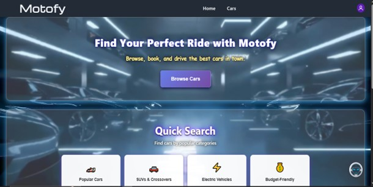
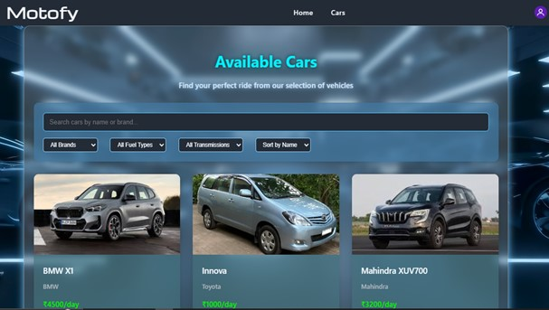
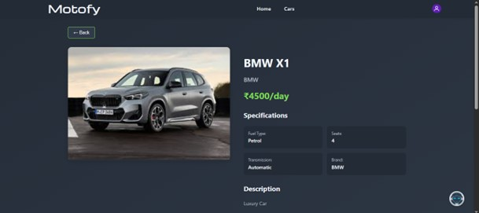
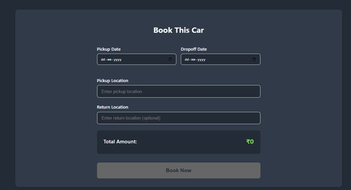
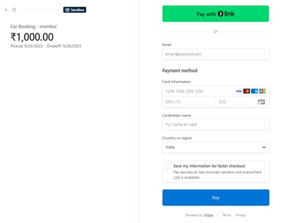
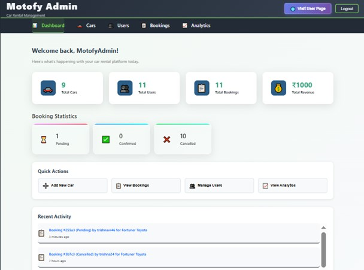
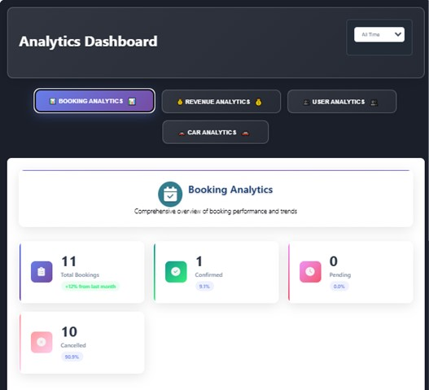

# 🚗 Motofy - Smart Car Rental Website

## 📖 About the Project

Motofy is a full-stack Car Rental Website developed using the MEAN stack. It allows users to browse available cars, view car details, book vehicles online, and make secure payments. The project also includes an Admin Panel to manage cars, bookings, and users.

---

## 🛠️ Tech Stack

### Frontend
- AngularJS
- HTML
- CSS
- JavaScript

### Backend
- Node.js
- Express.js

### Database
- MongoDB

### Other Technologies
- JWT Authentication
- Stripe Payment Gateway
- Gemini AI

---

## ✨ Key Features

### User Features
- User Registration & Login
- Browse Available Cars
- View Car Details
- Book Cars Online
- Secure Payment
- Booking History
- AI Chat Assistant

### Admin Features
- Admin Dashboard
- Manage Cars
- Manage Users
- Manage Bookings
- View Analytics

---

# 📸 Project Screenshots

## 🏠 Home Page

## 🔐 Login Page

## 🚗 Car Listing

## 🚘 Car Details

## 📅 Booking Page

## 💳 Payment Page

## ✅ Payment Success

## 📊 Admin Dashboard

## 🚙 Car Management

## 📈 Analytics Dashboard (Part 1)

## 📈 Admin Analytics Dashboard (Part 2)
.jpg)
